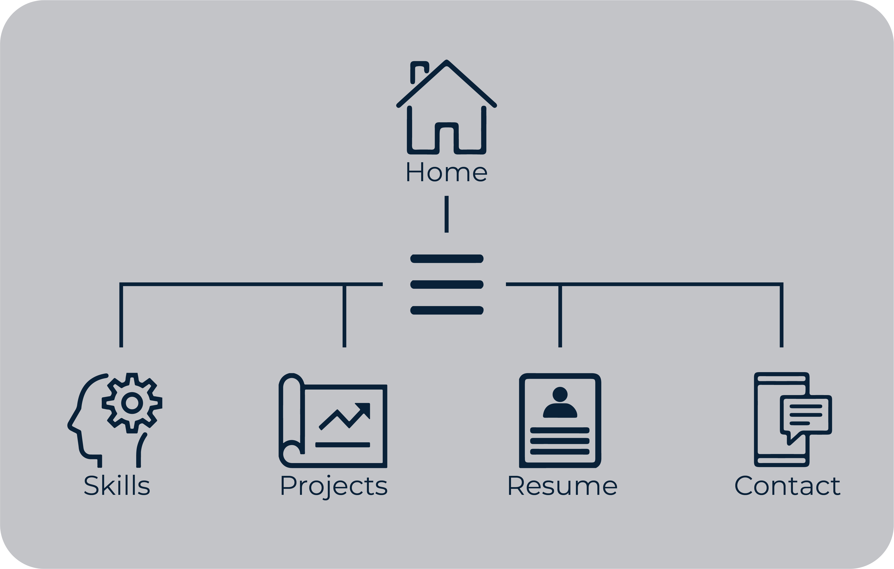
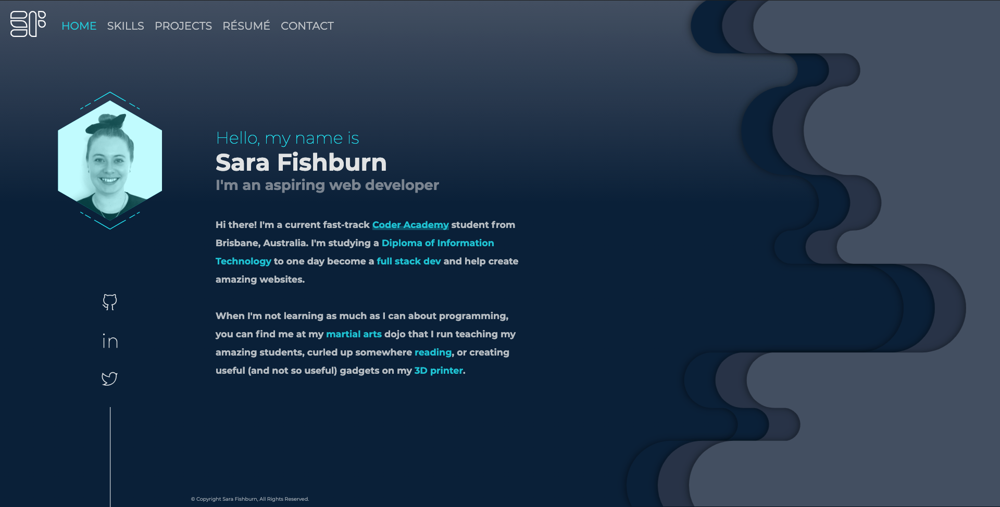
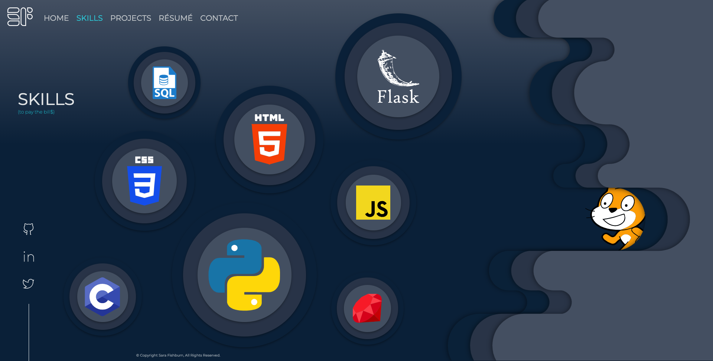
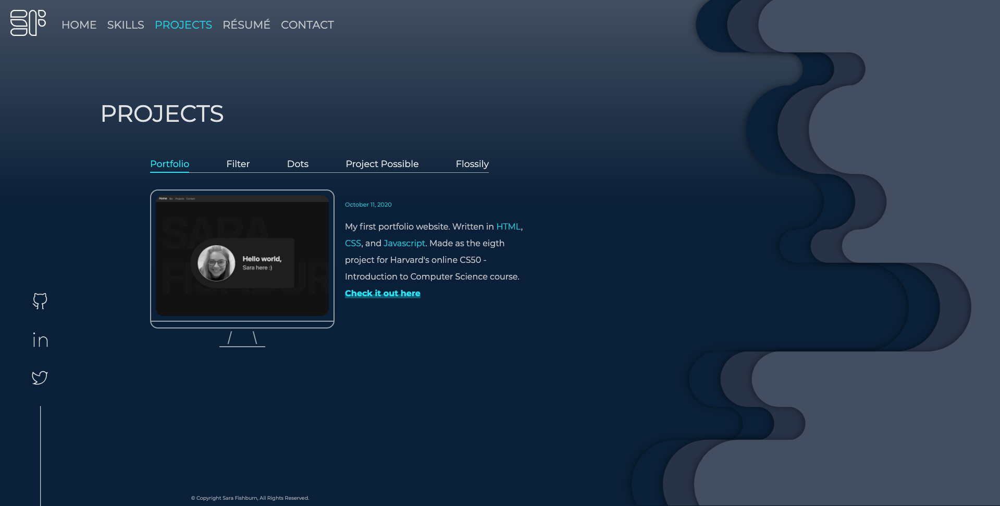
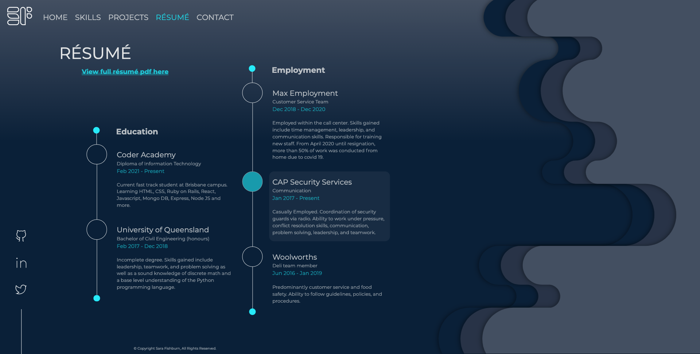
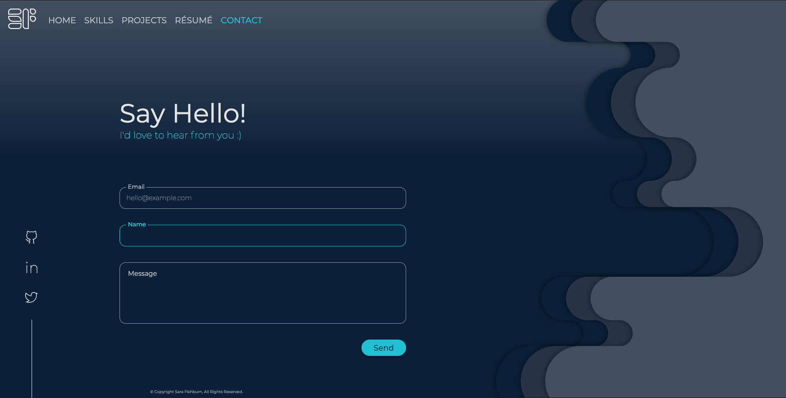

# Sara Fishburn Coder Academy T1A2 - Portfolio

## URL to published portfolio website

https://sarafishburn.github.io/

## Link to portfolio GitHub repository

https://github.com/SaraFishburn/SaraFishburn.github.io

## Description of portfolio website

### - Purpose and target audience -

The purpose of this portfolio is to provide an online medium in which skills, interests, and professional knowledge may be displayed.
The main target audience are potential employers who wish to view capabilities and gain insight into personality.

### - Sitemap -

### - Functionality and features -

The portfolio consists of 5 html pages supported by 6 css files each (3 global and 3 page specific css files for 3 different main viewport sizes).

All pages have social media icons which move up and change color on hover. These icons link to their respective social media profiles.
All pages have a hamburger menu at mobile viewport widths. When selected, the hamburger animates into a close 'X' and the nav menu reveals itself sliding in from the top of the page.
At tablet and desktop viewport sizes, the hamburger menu is replaced by a standard nav bar with links to all pages.
All pages share a common theme consisting of a gradient background and a 'drip' graphic to add visual interest for users.

#### index.html

The landing page. 
Contains greeting, introduction, and interests.
Hexagonal profile image is black and white with a transparent blue overlay. When hovered, this image changes to become colored.

#### skills.html

The skills page consists of several 'bubble' graphics which contain the logos of tech language/stylesheet proficiencies.
Javascript enables a parallax effect on mousemove and on phone tilt.

#### projects.html

With permission from the lead educator, the Projects page exists in place of a Blog page.
All projects have a completion date (sans work in progress which has a started date).

In addition to a standard image, other graphical elements utilised to display projects include:

- 2 carousels (powered by Flickity.js with minimal custom styling),
- an embedded youtbe video, and
- an embedded Scratch game

The 'Old Portfolio' project has a link to the deployed website, and 'Filter' and 'Flossily' projects have links to their respective GitHub repositories in the form of a GitHub logo which changes color on hover. This is in addition to a short description of each project.

At tablet and desktop viewport sizes, projects are displayed in a module tab format powered by javascript to add extra user interaction and prevent the need for page scrolling.

#### resume.html

The resume page contains a link to a resume PDF document hosted on google drive and a brief overview of education and employemnt history layed out with a visually engaging dot point graphic.
On hover of individual text sections, the text gains a semi-transparent white background and the corresponding dot pont circle gains a blue semi-transparent fill.

#### contact.html

The contact page contains a working contact form linked to a google form which in turn deposits data in a google sheet.

The form is styled after a basic 'Material Design' form. When an input field is selected, the label shrinks and moves from inside the input field to the border.
On hover, the send button's drop shadow subtley intensifies, the button sacles slightly, and opacity is increased to 1. 
On click, these transformations intensify further.

The form also has validation which disallows a user to submit a form with empty text fields and displays error/helper messages below the input fields.
On successful submission, a thank you message appears at the bottom of the form.

### - Tech stack -

This portfolio website utilises the following technology:

**Languages / stylesheets:**
- HTML
- CSS
- Javascript

**Version control / deployment:**
- GitHub
- GitHub Pages

